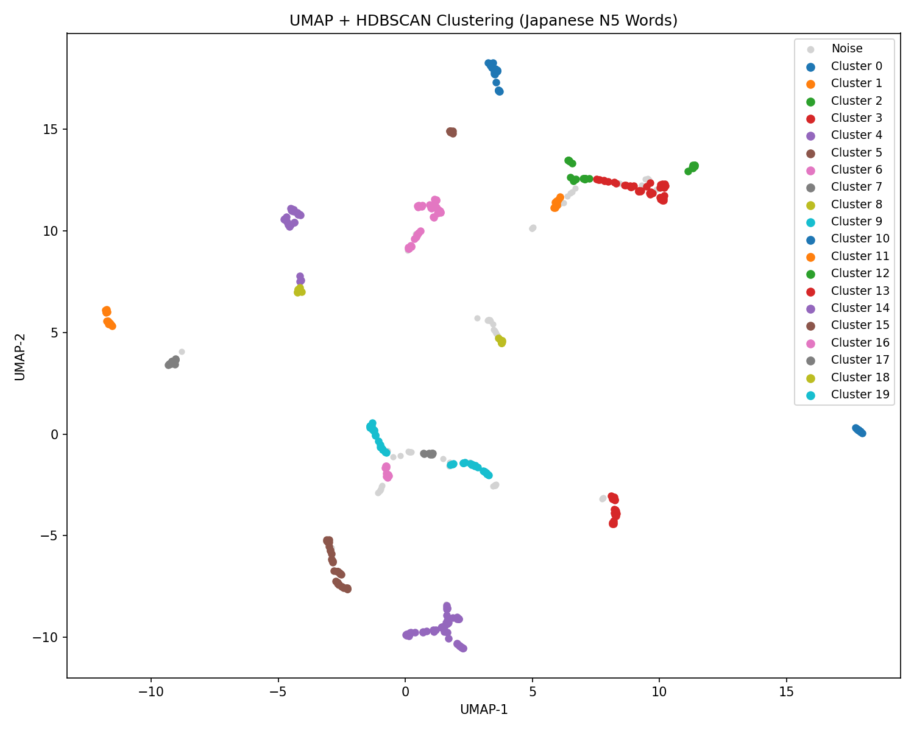
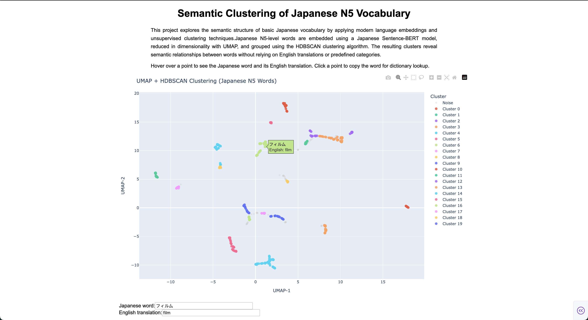

# Japanese words clustering

## Table of Contents
- [About](#about)
- [Pipeline steps](#pipeline-steps)
- [Installation](#installation)
- [Usage](#usage)
- [Authors](#authors)

## About <a name= "about"></a>
**Motivation**


When learning a new language, an important part of it is acquiring vocabulary (nouns, verbs, adjectives) to be able to make proper sentences. The Japanese Language proficiency Test (JLPT) ranges from the easiest level N5 (N for Nihongo) to the most difficult level N1. To reach this level, it requires mastering grammatical aspects along with learning 2000 Kanji, 10.000 vocabulary words. Indeed effective language learning relies on acquiring vocabulary by memorizing it. **But how can we "memorize" vocabulary in an efficient manner?** There are diverse strategies to memorize vocabulary and one of them is topic-based learning. With this strategy, the student avoids learning isolated words that may not have any relation to each other and that might be difficult to use them together in the same conversation or even the same sentence. 
In this strategy, topic-based learning beats pure "memorization by heart" of random list of words.


From there comes the idea of this project to cluster japanese words from the simplest level N5 to see which words could be learned or used together and facilitate language learning.

This project explores the semantic structure of basic Japanese vocabulary by applying modern language embeddings and unsupervised clustering techniques. Japanese N5-level words are embedded using a Japanese Sentence-BERT model, reduced in dimensionality with UMAP (Uniform Manifold Approximation and Projection), and grouped using the HDBSCAN (Hierarchical Density-Based Spatial Clustering of Applications with Noise) clustering algorithm. The resulting clusters reveal semantic relationships between words without relying on English translations or predefined categories.

## Pipeline steps <a name= "pipeline-steps"></a>

The dataset [JLPT vocabulary by level](https://www.kaggle.com/datasets/robinpourtaud/jlpt-words-by-level) comes from Kaggle.


**Part of speech filtering**

Part of speech (POS) filtering is a technique that assigns a label and separate words based on their grammatical  role, for example noun, verb or adjective.
In that case I applied part of speech filtering using the tokenizer from the library SudachiPy, a Japanese morphological analyzer. 
POS involves morphological analyis, that breaks down the word into their constituent morpheme to determine their part-of-speech. I kept multi-token words. Moreover, I filtered the words labeled as "名詞", "動詞", "形容詞" meaning nouns, verbs and adjectives and removed adverbs, onomatopoeia, pronouns etc... and obvious noise like words containing punctuation. This step will help for the downstream clustering step where I aim to have more meaningful clusters.

**Tokenize and Embed**

I tokenized the words by treating each japanese word as a single token. In that case, this was simple since the dataset is a column of japanese words, so one word per row. I used the Japanese sentence-BERT embedding model [`sonoisa/sentence-bert-base-ja-mean-tokens`](https://huggingface.co/sonoisa/sentence-bert-base-ja-mean-tokens). The vectors are saved in the `data` folder as `jlpt_word_vectors_bert.npy`.  Next, the embeddings were normalizede using standard scaler from scikit-learn.

**Dimensionality reduction**


Before clustering, I used UMAP (Uniform Manifold Approximation and Projection) for dimensionality reduction, reducing the vectors' dimension to 15 dimension (15D). The random seed was set to a specific value to ensure reproducibility. 

**Clusters discovery**


Clustering was performed using HDBSCAN (Hierarchical Density-Based Spatial Clustering of Applications with Noise), a
clustering algorithm that finds groups (clusters) of similar data points based on density.

**Visualization**


The embeddings first went through a dimensionality reduction using UMAP to get a 2D dimension. The image produced and saved as a png is the result of a 2D visualization of the clusters using matplotlib. One needs to take into account that UMAP was used as a preprocessing step and so distance in 2D are approximate. 

<p align="center">
  
</p>

**App**

The app uses dash and plotly to display the 2D visualization of the clusters. When the user hover over the data point, the japanese word and its translation are displayed. The word `フィルム` (pronounce firumu, film) clusters with the word `映画` (pronounce Eiga, movie).
Moreover, clicking on the data point displays the japanese words at the bottom with the english translation below, to allow the user or a student to copy the word and use it. 

<p align="center">
  
</p>

## Installation <a name= "installation"></a>


### Setup environment

Create an environment:

The environment uses python 3.10. It was installed using `pyenv install 3.10.13`.
```
uv init
uv add pandas sudachipy sudachidict_core numpy
uv add torch==2.2.2 torchvision==0.17.2
uv add transformers
uv add "numpy<2"
uv add matplotlib
uv add plotly dash
uv add "scikit-learn>=1.3,<2.0"
uv add "llvmlite==0.43"
uv add "numba==0.60"
uv add "umap-learn==0.5.6"
uv add hdbscan
ud add snakemake
uv add "pulp<2.8.0"
```

With the up-to-date `pyproject.toml`, it is usually sufficient to run in the terminal (root project):

```
uv sync
```

## Usage <a name= "usage"></a>

To recreate the outputs, in the terminal, run:
```
uv run snakemake -c1
```

To run the app use:
```
uv run app.py
```


### Authors <a name= "authors"></a>
Pauline Dao
